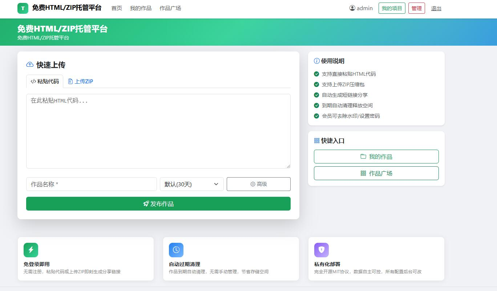
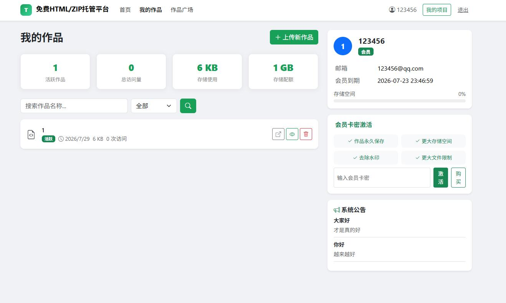
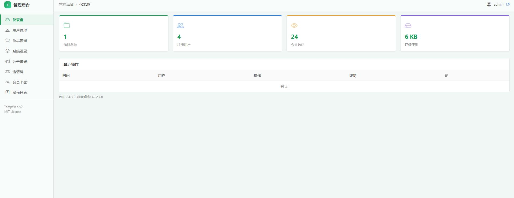

# tempweb
TempWeb 是一个静态网站托管平台源码
# TempWeb 搭建部署指南



网络技术交流群:518822484

## 一、环境要求

| 环境 | 版本要求 | 推荐版本 |
|------|----------|----------|
| PHP | 7.2+ | 7.4 或 8.0 |
| MySQL | 5.7+ | 5.7 或 8.0 |
| Nginx | 1.18+ | 1.21+ |
| PHP扩展 | pdo_mysql, json, mbstring, zip, gd, curl | - |

---

## 二、宝塔面板部署（推荐）

### 2.1 创建网站

1. 登录宝塔面板
2. 点击「网站」→「添加站点」
3. 填写域名（如 `tempweb.example.com`）
4. PHP版本选择 `7.4` 或 `8.0`
5. 创建数据库，名称如 `tempweb`
6. 点击「提交」

### 2.2 上传文件

1. 将项目文件上传到网站根目录（如 `/www/wwwroot/tempweb.example.com`）
2. 或使用 Git 克隆：
   ```bash
   cd /www/wwwroot
   git clone https://github.com/xxx/tempweb.git tempweb.example.com
   ```

### 2.4 配置伪静态

宝塔面板 → 网站 → 设置 → 伪静态，添加以下规则：

location / {
    try_files $uri $uri/ /index.php$is_args$args;
}
### 2.5 配置数据库
backend\config.php

### 2.6 配置数据库
tempweb.sql导入数据

后台密码admin123

# TempWeb 用户使用指南

## 一、平台简介

TempWeb 是一个静态网站托管平台源码。你可以：
- 粘贴 HTML 代码，一键生成可分享链接
- 上传 ZIP 文件，自动解压展示
- 设置访问密码、过期时间、自定义短码
- 管理你的所有作品

---

## 二、用户角色

| 角色 | 说明 |
|------|------|
| 游客 | 无需登录，可直接上传作品，有文件大小和过期时间限制 |
| 普通用户 | 注册登录后可管理作品、查看统计、设置更长过期时间 |
| 会员 | 拥有更多特权：去除水印、密码保护、自定义短码、更大存储空间 |
| 管理员 | 系统管理权限，可管理用户、项目、系统设置等 |

---

## 三、上传作品

### 3.1 粘贴 HTML 代码

1. 打开首页，选择「粘贴代码」标签
2. 在代码编辑框中粘贴你的 HTML 代码
3. 填写作品名称（可选）
4. 设置过期时间（默认 7 天）
5. 点击「上传」按钮
6. 获取短链接，即可分享

### 3.2 上传 ZIP 文件

1. 选择「上传 ZIP」标签
2. 拖拽或点击选择 ZIP 文件
3. ZIP 文件会自动解压，以 `index.html` 作为入口
4. 填写作品信息，点击上传

### 3.3 上传设置

| 设置项 | 说明 | 权限要求 |
|--------|------|----------|
| 作品名称 | 作品名称，用于管理识别 | 所有用户 |
| 作品描述 | 作品简介 | 所有用户 |
| 标签 | 分类标签，逗号分隔 | 所有用户 |
| 过期时间 | 作品保存天数 | 游客/用户有限制，会员可设置更长 |
| 访问密码 | 设置密码保护 | 仅会员 |
| 自定义短码 | 自定义访问链接后缀 | 仅会员 |
| 去除水印 | 不显示底部水印条 | 仅会员 |
| 公开作品 | 显示在作品广场 | 所有用户 |

---

## 四、管理作品

### 4.1 作品列表

登录后进入「我的作品」页面，可以：
- 查看所有作品（活跃、已过期）
- 搜索作品名称
- 查看作品状态、大小、访问量
- 查看存储配额使用情况

### 4.2 作品操作

| 操作 | 说明 |
|------|------|
| 访问 | 打开作品链接 |
| 编辑 | 修改作品名称、描述、标签 |
| 下载 | 下载作品源码 ZIP |
| 删除 | 删除作品（不可恢复） |
| 统计 | 查看访问统计 |

### 4.3 作品状态

| 状态 | 说明 |
|------|------|
| 活跃 | 作品正常可访问 |
| 已过期 | 作品已过期，无法访问 |
| 已下架 | 作品因违规被管理员下架 |

---

## 五、会员功能

### 5.1 会员权益

- **去除水印**：作品底部不显示水印条
- **密码保护**：可设置访问密码
- **自定义短码**：可自定义访问链接（如 `/s/my-project`）
- **更大存储空间**：会员配额更大
- **更大文件限制**：可上传更大的文件
- **更长保存时间**：作品可保存更久

### 5.2 获取会员

**方式一：购买会员**
- 在「我的作品」页面点击「购买」按钮
- 跳转到支付页面完成购买

**方式二：激活卡密**
- 在「会员卡密激活」区域输入卡密
- 点击「激活」按钮
- 激活成功后自动获得会员权益

---

## 六、作品广场

作品广场展示所有公开的作品：
- 按最新排序
- 可搜索作品名称
- 点击作品卡片直接访问

---

## 七、常见问题

### Q1: 作品过期了怎么办？
作品过期后无法访问，但数据仍保留。管理员可以恢复过期作品。

### Q2: 如何修改作品内容？
上传后无法修改内容，只能删除重新上传。可以修改作品名称、描述、标签等信息。

### Q3: 游客上传的作品会保存多久？
默认保存天数由后台设置，一般为 7 天。

### Q4: 存储配额不足怎么办？
- 普通用户：删除不需要的作品释放空间
- 会员：升级会员获得更大配额

### Q5: 作品被下架了怎么办？
作品因违规被管理员下架，请联系管理员处理。

---

## 八、联系支持

如有问题，请联系管理员或在 GitHub 提交 Issue。
